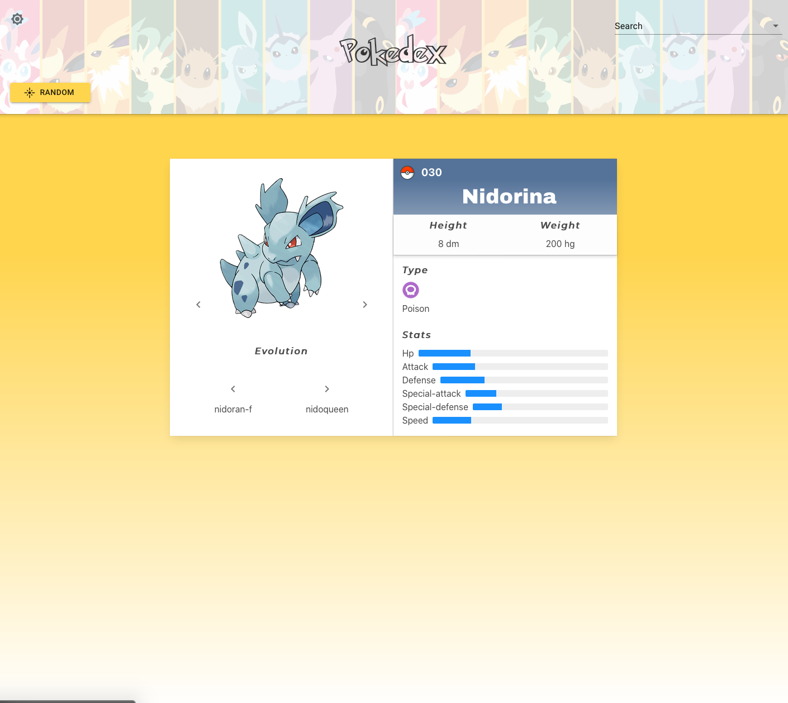
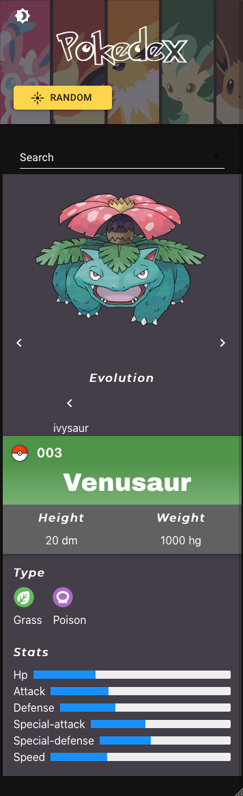

# React Pokedex

Pokedex frontend built with React using [PokeApi](https://www.pokeapi.com).

## Features

- Fully responsive
- State handled by Context API
- All Pokemon names cached using React Query for autocomplete search by name
- Material UI components
- Custom hook saves user dark or light theme preference in local storage
- Get random Pokemon
- Dynamic card background changes depending on given Pokemon's color

## Screenshots

#### Light mode, desktop

### Dark mode, mobile

## Installation and Setup Instructions

### Clone or download this repository. You will need node and npm installed globally on your machine.

### Installation:

`yarn install`

To Start Server:

`yarn start`

To view app locally:

`localhost:3000`

## Testing

`yarn test`

Launches the test runner in the interactive watch mode. 
